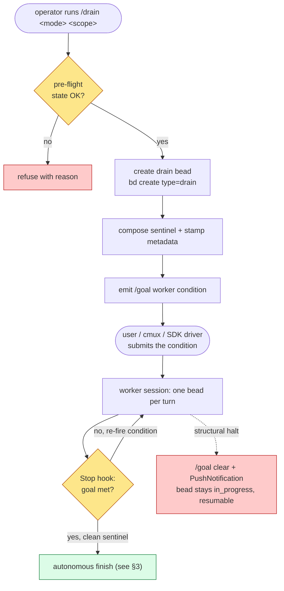
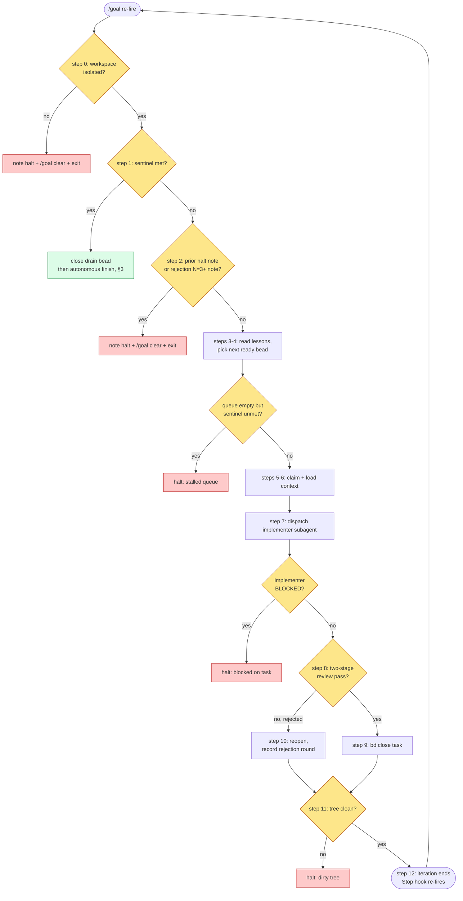
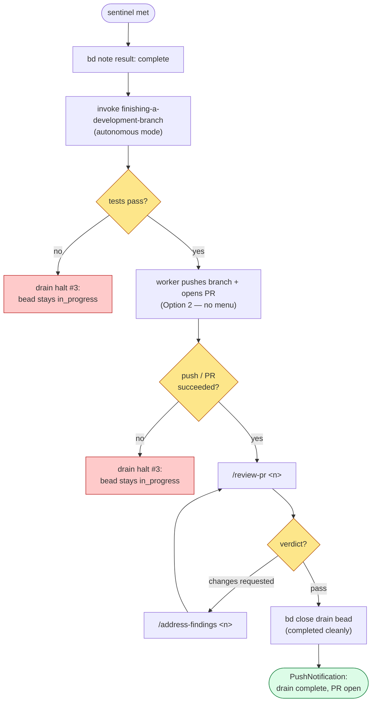

<!-- markdownlint-disable MD013 -->

# Drain flow (visual reference)

Companion diagrams for the `dev-flow:draining-beads` skill and the `/drain`
command. These are a human-oriented map of control flow that the skill prose
specifies authoritatively — when this doc and the skill disagree, the skill (and
the spec it cites) wins. See:

- `dev-flow/skills/draining-beads/SKILL.md` — sentinel design, 12-step protocol,
  halt conditions, lessons mechanism, edge cases
- `dev-flow/commands/drain.md` — operator entry point (pre-flight, create bead,
  emit `/goal` condition)
- `dev-flow/commands/drain-with-worker.md` + `dev-flow/references/drain-with-worker.md`
  — detached cmux worker + surface-aware watchdog
- `docs/superpowers/specs/2026-05-22-drain-skill-design.md` — design spec (source
  of truth)

## 1. Controller / worker split and the `/goal` loop

`/drain` (the controller turn) only sets up state and **emits** the `/goal`
worker condition; it never fires `/goal` itself (a user-only built-in — ADR
`fhsk-e4i`). A user or driver submits that condition to a worker session, whose
Stop hook re-fires it once per bead until the sentinel is met or a halt clears
the goal.

## 2. Per-iteration protocol (one bead per `/goal` re-fire)

Each re-fire runs exactly one bead through the 12-step body. Step 0 guards
workspace isolation; step 1 checks the sentinel (and, when met, hands off to the
autonomous finish in §3); steps 2 and the rejection/dirty-tree branches are the
structural halts. Two details the diagram compresses: the rejection
circuit-breaker is recorded at step 10 and only *trips* on the next re-fire's
step 2 (which scans `rejection:`/`halt:` notes written by prior iterations), and
a lost claim race at step 5 restarts the iteration rather than proceeding.

## 3. Terminal path: autonomous finish at the clean sentinel

When the sentinel is met, the worker finishes the branch **autonomously** — no
menu, no prompt — by invoking `dev-flow:finishing-a-development-branch` in its
non-interactive mode (ADR `fhsk-8g6`). The action is fixed to Option 2 (push +
create PR) followed by the `/review-pr` gate. Merge, keep, and discard stay
human-only. The drain bead is closed **only after a clean finish**; an aggregate
test failure or a push/PR failure routes to halt condition #3 and leaves the
drain bead `in_progress` for resume.

## Related ADRs

| ADR | Decision |
|-----|----------|
| `fhsk-thw` | Use `/goal` over `/loop` for autonomous bead-queue drains |
| `fhsk-e4i` | Never invoke `/goal` from a skill; emit the condition for a user/driver |
| `fhsk-eqt` | Store the iteration protocol in the skill, not the `/goal` condition |
| `fhsk-zds` | Use the drain bead as the cross-session handoff carrier |
| `fhsk-ce3` | Store drain lessons in bd notes, not the prompt body |
| `fhsk-dtk` | Gate detached worker launch behind `AskUserQuestion`, never auto-fire |
| `fhsk-8g6` | Drain finishes the branch autonomously (push + PR) at the clean sentinel |
