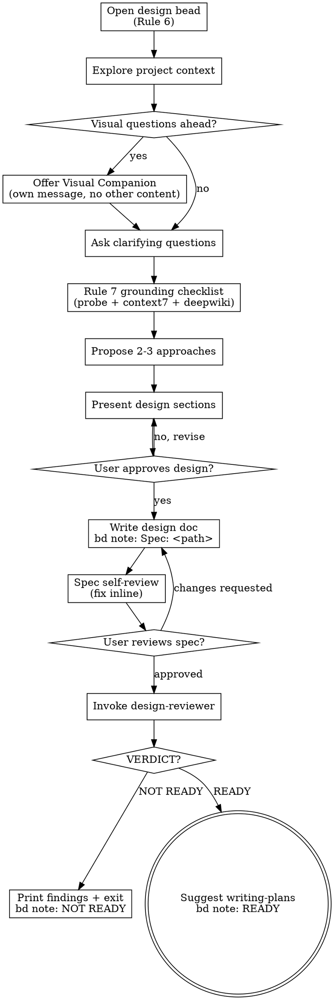

> **Before running any VCS commands, read references/vcs-preamble.md and use the appropriate commands for the detected VCS (git or jj).**

# Brainstorming Ideas Into Designs

Help turn ideas into fully formed designs and specs through natural collaborative dialogue.

Start by understanding the current project context, then ask questions one at a time to refine the idea. Once you understand what you're building, present the design and get user approval.

<HARD-GATE>
Do NOT invoke any implementation skill, write any code, scaffold any project, or take any implementation action until you have presented a design and the user has approved it. This applies to EVERY project regardless of perceived simplicity.
</HARD-GATE>

## Open the design bead (Rule 6)

Before exploring the idea, open a design bead so the whole lifecycle (brainstorming → design-reviewer → writing-plans → plan-reviewer → capture-adrs → plan-to-beads) shares one stable bd ID and audit trail.

1. Ask the user via `AskUserQuestion`: "Open a design bead in bd to track this work? (Y/n)"
   - Default **Y** for substantive prompts (anything that sounds like a project / feature / refactor / subsystem).
   - Default **N** for clearly exploratory prompts ("let me try X to see", "just curious how Y works").
2. On **Y**: run `bd create --type=task --title="Design: <provisional>" --labels="phase:design" --priority=2`. Capture the returned bead ID — every grounding-trace note and reviewer-round note below references it.
3. On **N**: skip bead creation; proceed without tracking. (If implementation work later emerges, `plan-to-beads` will mint a fresh design bead at that point.)

Record provenance notes as the session progresses:

- After the spec is written: `bd note <design-bead-id> "Spec: <path>"`.
- After each grounding source consulted (next section): `bd note <design-bead-id> "grounding/<source>: <query> — 
"`.
- After each design-reviewer round (end-of-skill): `bd note <design-bead-id> "design-review round N: <verdict>"`.

If `bd` is unavailable, the skill warns once and continues without the bead. Grounding still runs; reviewer still fires; no audit trail.

## Anti-Pattern: "This Is Too Simple To Need A Design"

Every project goes through this process. A todo list, a single-function utility, a config change — all of them. "Simple" projects are where unexamined assumptions cause the most wasted work. The design can be short (a few sentences for truly simple projects), but you MUST present it and get approval.

## Checklist

You MUST create a task for each of these items and complete them in order:

1. **Open the design bead** — per Rule 6 (see "Open the design bead" section above)
2. **Explore project context** — check files, docs, recent commits
3. **Offer visual companion** (if topic will involve visual questions) — this is its own message, not combined with a clarifying question. See the Visual Companion section below.
4. **Ask clarifying questions** — one at a time, understand purpose/constraints/success criteria
5. **Run the Rule 7 grounding checklist** — probe the codebase + context7 every named dependency + deepwiki for upstream conventions (see "Grounding before design" section below). Append a `bd note` per source consulted.
6. **Propose 2-3 approaches** — with trade-offs and your recommendation
7. **Present design** — in sections scaled to their complexity, get user approval after each section
8. **Write design doc** — save to `docs/superpowers/specs/YYYY-MM-DD-<topic>-design.md` and commit. Append `bd note <design-bead-id> "Spec: <path>"`.
9. **Spec self-review** — quick inline check for placeholders, contradictions, ambiguity, scope (see below)
10. **User reviews written spec** — ask user to review the spec file before proceeding
11. **Invoke design-reviewer** — parse VERDICT line; on READY suggest writing-plans, on NOT READY print findings and exit (see "Design review gate" section below)

## Process Flow

**The terminal state is the design-reviewer gate.** On READY: suggest `writing-plans` as the next step. On NOT READY: print findings and exit — user revises the spec and re-invokes brainstorming. Do NOT invoke frontend-design, mcp-builder, or any other implementation skill. The ONLY skill the user invokes after a READY verdict is writing-plans.

## The Process

**Understanding the idea:**

- Check out the current project state first (files, docs, recent commits) —
  and make sure it is actually *current*: fetch and verify against origin/main
  (or the relevant branch) before exploring, so you design against code that
  exists today, not a stale local checkout. See `references/vcs-preamble.md`
  § "Ensure Current Before You Work" (in jj, `jj git fetch` leaves the local
  `main` bookmark stale — compare against `trunk()` / `main@origin`).
- Before asking detailed questions, assess scope: if the request describes multiple independent subsystems (e.g., "build a platform with chat, file storage, billing, and analytics"), flag this immediately. Don't spend questions refining details of a project that needs to be decomposed first.
- If the project is too large for a single spec, help the user decompose into sub-projects: what are the independent pieces, how do they relate, what order should they be built? Then brainstorm the first sub-project through the normal design flow. Each sub-project gets its own spec → plan → implementation cycle.
- For appropriately-scoped projects, ask questions one at a time to refine the idea
- Prefer multiple choice questions when possible, but open-ended is fine too
- Only one question per message - if a topic needs more exploration, break it into multiple questions
- Focus on understanding: purpose, constraints, success criteria

**Grounding before design (Rule 7):**

Before proposing any approach you MUST consult the grounding sources below. Each consulted source becomes a `bd note` line on the design bead — `plan-reviewer` later reads these traces to flag ungrounded plans. The grounding precedence is **semantic-first, then raw**: probe before Read; context7 before WebFetch.

- **Probe the codebase for prior art.** Use `mcp__probe__search_code "<feature name>"` to surface existing implementations the user may have forgotten. Append `bd note <design-bead-id> "grounding/probe: <query> — <hit summary>"`.
- **Context7 every named external dependency.** If any approach mentions a library, framework, SDK, API, CLI tool, or cloud service, call `mcp__context7__resolve-library-id "<name>"` then `mcp__context7__query-docs <library-id> "<the question>"`. This is **not optional**, even for libraries you think you know — training data goes stale. Append `bd note <design-bead-id> "grounding/context7: <library-id> — <one-line summary>"` per library.
- **Deepwiki for upstream-repo conventions.** When the topic touches a GitHub-hosted library whose conventions matter (proto file layout, plugin API shape, migration discipline), start with `mcp__deepwiki__read_wiki_structure <org>/<repo>` to map topics, then `mcp__deepwiki__read_wiki_contents` for the relevant section OR `mcp__deepwiki__ask_question` for targeted Q&A. Append `bd note <design-bead-id> "grounding/deepwiki: <repo> — 
"`.
- **Optional: Exa + firecrawl for state-of-the-art.** When the question is "what's the current state of the art for X" or "has Y changed recently", use `mcp__exa__web_search_exa` to surface relevant URLs, then `mcp__firecrawl-mcp__firecrawl_scrape` (or the `firecrawl` skill) for content. Append `bd note <design-bead-id> "grounding/exa: <query> — <result summary>"`.

**Degraded mode:** If a grounding tool is unavailable, note the gap inline ("context7 unavailable; relying on training data for library X — flag for reviewer"). `plan-reviewer` will surface the gap as a plan-level finding rather than treating absence as a hard error.

**Exploring approaches:**

- Propose 2-3 different approaches with trade-offs
- Present options conversationally with your recommendation and reasoning
- Lead with your recommended option and explain why

**Presenting the design:**

- Once you believe you understand what you're building, present the design
- Scale each section to its complexity: a few sentences if straightforward, up to 200-300 words if nuanced
- Ask after each section whether it looks right so far
- Cover: architecture, components, data flow, error handling, testing
- Be ready to go back and clarify if something doesn't make sense

**Design for isolation and clarity:**

- Break the system into smaller units that each have one clear purpose, communicate through well-defined interfaces, and can be understood and tested independently
- For each unit, you should be able to answer: what does it do, how do you use it, and what does it depend on?
- Can someone understand what a unit does without reading its internals? Can you change the internals without breaking consumers? If not, the boundaries need work.
- Smaller, well-bounded units are also easier for you to work with - you reason better about code you can hold in context at once, and your edits are more reliable when files are focused. When a file grows large, that's often a signal that it's doing too much.

**Working in existing codebases:**

- Explore the current structure before proposing changes. Follow existing patterns.
- Where existing code has problems that affect the work (e.g., a file that's grown too large, unclear boundaries, tangled responsibilities), include targeted improvements as part of the design - the way a good developer improves code they're working in.
- Don't propose unrelated refactoring. Stay focused on what serves the current goal.

## After the Design

**Documentation:**

- Write the validated design (spec) to `docs/superpowers/specs/YYYY-MM-DD-<topic>-design.md`
  - (User preferences for spec location override this default)
- Use elements-of-style:writing-clearly-and-concisely skill if available
- Commit using VCS-appropriate commands per `references/vcs-preamble.md`

**Spec Self-Review:**
After writing the spec document, look at it with fresh eyes:

1. **Placeholder scan:** Any "TBD", "TODO", incomplete sections, or vague requirements? Fix them.
2. **Internal consistency:** Do any sections contradict each other? Does the architecture match the feature descriptions?
3. **Scope check:** Is this focused enough for a single implementation plan, or does it need decomposition?
4. **Ambiguity check:** Could any requirement be interpreted two different ways? If so, pick one and make it explicit.

Fix any issues inline. No need to re-review — just fix and move on.

**User Review Gate:**
After the spec review loop passes, ask the user to review the written spec before proceeding:

> "Spec written and committed to `<path>`. Please review it and let me know if you want to make any changes before we start writing out the implementation plan."

Wait for the user's response. If they request changes, make them and re-run the spec review loop. Only proceed once the user approves.

## Design Review Gate

After the spec self-review and user review both pass, the skill MUST invoke the `design-reviewer` agent before suggesting the next step. The reviewer is read-only and adversarial; its job is to flag ungrounded specs (Rule 7) and surface contradictions.

1. **Invoke `design-reviewer`** against the spec path. Pass the design bead ID (if one was opened) as additional context so the reviewer can `bd show <id>` to inspect grounding-trace notes.
2. **Parse the first non-empty line** of the reviewer's output via exact-match regex `^VERDICT: (READY|NOT READY)$`.
3. **Branch on the verdict:**

   - **READY:** Append `bd note <design-bead-id> "design-review READY (round N)"`. Tell the user: "Spec is READY. The next step is to invoke `writing-plans` to create the implementation plan." Exit.
   - **NOT READY:** Append `bd note <design-bead-id> "design-review round N NOT READY: <one-line finding summary>"`. Print the reviewer's full findings inline so the user sees them. Exit. The user revises the spec based on the findings and re-invokes brainstorming for the next round.
   - **Missing or unparseable VERDICT line:** Treat as NOT READY. Print the agent's full output and append `bd note "design-review round N NOT READY: unparseable verdict"`.

4. **No automatic retry.** Review→revise loops are user-paced. There is no max-iteration cap; if a verdict bounces between READY and NOT READY across runs, broaden the design discussion rather than iterating mechanically.

**Do NOT invoke any other skill from inside brainstorming.** The terminal action is the design-reviewer gate. The user invokes `writing-plans` themselves after a READY verdict.

## Key Principles

- **One question at a time** - Don't overwhelm with multiple questions
- **Multiple choice preferred** - Easier to answer than open-ended when possible
- **YAGNI ruthlessly** - Remove unnecessary features from all designs
- **Explore alternatives** - Always propose 2-3 approaches before settling
- **Incremental validation** - Present design, get approval before moving on
- **Be flexible** - Go back and clarify when something doesn't make sense

## Visual Companion

A browser-based companion for showing mockups, diagrams, and visual options during brainstorming. Available as a tool — not a mode. Accepting the companion means it's available for questions that benefit from visual treatment; it does NOT mean every question goes through the browser.

**Offering the companion:** When you anticipate that upcoming questions will involve visual content (mockups, layouts, diagrams), offer it once for consent:
> "Some of what we're working on might be easier to explain if I can show it to you in a web browser. I can put together mockups, diagrams, comparisons, and other visuals as we go. This feature is still new and can be token-intensive. Want to try it? (Requires opening a local URL)"

**This offer MUST be its own message.** Do not combine it with clarifying questions, context summaries, or any other content. The message should contain ONLY the offer above and nothing else. Wait for the user's response before continuing. If they decline, proceed with text-only brainstorming.

**Per-question decision:** Even after the user accepts, decide FOR EACH QUESTION whether to use the browser or the terminal. The test: **would the user understand this better by seeing it than reading it?**

- **Use the browser** for content that IS visual — mockups, wireframes, layout comparisons, architecture diagrams, side-by-side visual designs
- **Use the terminal** for content that is text — requirements questions, conceptual choices, tradeoff lists, A/B/C/D text options, scope decisions

A question about a UI topic is not automatically a visual question. "What does personality mean in this context?" is a conceptual question — use the terminal. "Which wizard layout works better?" is a visual question — use the browser.

If they agree to the companion, read the detailed guide before proceeding:
`skills/brainstorming/visual-companion.md`
