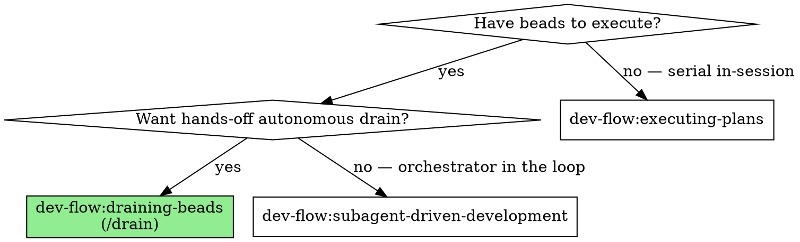

# Draining beads

Autonomous, hands-off bead iteration driven by Claude Code's `/goal` Stop-hook
primitive. One `/drain` invocation pours a per-run drain bead, fires `/goal`,
and then iterates until a clean sentinel or a structural halt — without operator
input between tasks.

The canonical contract lives in
`docs/superpowers/specs/2026-05-22-drain-skill-design.md`. This skill is the
discoverable reference; cite the spec for any contract change.

## Overview

The harness is three pieces:

| Piece | Role |
|---|---|
| `/drain` slash command | Operator entry point: pre-flight, pour drain bead, fire `/goal` |
| `draining-beads` skill | This file — sentinel design, halt conditions, lessons, edge cases |
| `formula-drain.formula.toml` | bd formula scaffolding the per-run drain bead |

`/goal` (not `/loop`) is the iteration primitive. `/goal` is Claude Code's
native Stop-hook mechanism (verified in binary `2.1.148`): it re-fires a
curated prompt body on every Stop hook until the model sets `goal_status.met`.
Per ADR `fhsk-thw`, `/loop`'s real purpose is timer-based external-state
polling — it has no legitimate niche for bead iteration.

Each iteration runs the 12-step body embedded in `commands/drain.md`. Step 3
of that body reads lessons from `bd` notes. Lessons replace the "self-evolving
prompt" anti-pattern: they route through `bd` instead of mutating the prompt
body each round.

## When to use

**vs. `subagent-driven-development` (SDD):** The draining-beads harness calls
SDD's per-iteration 12-step body on every Stop-hook cycle. SDD is the inner
mechanism; `draining-beads` is the autonomy wrapper. Use `/drain` when you want
hands-off epic drain via `/goal`. Use SDD directly when you want an
orchestrator-in-the-loop between tasks.

**vs. `executing-plans`:** Single-session serial execution, no fresh subagents.
Use `executing-plans` as the lightweight alternative when autonomy is not
required or when the session must stay in-context.

## Sentinel design

`/goal`'s `condition` is natural-language evaluated by the model each Stop-hook
iteration. The harness phrases each condition as a checkable predicate the model
can verify with one `bd` query:

| Mode | Sentinel | Verification query |
|---|---|---|
| `epic <id>` | `All beads under epic <id> are closed.` | `bd list --status=open --parent <id> --json \| jq 'length == 0'` |
| `set <ids…>` | `All of {<id1>, …} are closed.` | `for id in $SEEDS; do bd show $id --json \| jq -e '.status == "closed"'; done` |
| `cascade <ids…>` | `All beads in the cascade-reachable set from {seeds} are closed.` | Maintain working set; expand via `bd dep list <id> --direction=up` after each close; query: any open bead in working set? |

See the spec for canonical predicate strings.

## Halt conditions

Three structural events cause the iteration body to explicitly clear `/goal`,
emit a `PushNotification`, and leave the drain bead `--status=in_progress` for
resume:

| # | Trigger | What gets recorded on the drain bead |
|---|---|---|
| 1 | Implementer returns `BLOCKED` status | `bd note <task-id> "BLOCKED iter N: <reason>"`; `bd note <drain-id> "halt: blocked on <task-id>; reason=<short>"` |
| 2 | ≥ 3 rejection rounds on a single task | `bd note <task-id> "rejection round N: <reason>"`; `bd note <drain-id> "rejection: <task-id> N=3"`. Halt-check fires on next iteration's step 2. |
| 3 | VCS / harness failure (dirty working tree across iterations, push fails, `bd dolt` unreachable) | `bd note <drain-id> "halt: vcs-failure; detail=<short>"` |

On any halt: `goal_status.met=false`; drain bead stays `in_progress` (resumable
via `/drain resume <drain-id>`). On clean sentinel: close the drain bead with a
result note.

★ **Insight:** Halt ≠ failure. A halted drain bead is an auditable checkpoint.
The operator triages via `bd show <drain-id>`, resolves the blocker, and resumes.

## Lessons mechanism

Run-level observations are stored as `bd` notes rather than by editing the
prompt body. This eliminates prompt drift and makes lessons queryable. Per ADR
`fhsk-ce3`:

| Scope | Command | Lifetime |
|---|---|---|
| **Run-scoped** | `bd note <drain-id> "lesson: <text>"` | Ephemeral — closes with the drain bead |
| **Epic-scoped** | `bd note <epic-id> "lesson: <text>"` | Persistent — survives across all future runs against this epic |

Step 3 of the iteration body reads both tiers via prefix filter and injects the
collected text into the next implementer subagent's prompt. The orchestrator
elevates a lesson from run-scoped to epic-scoped when it judges the observation
generalizable beyond the current run.

## Edge cases

### Codex compatibility

`/goal` is Claude Code-only. Codex users get a manual loop recipe: drive
iterations interactively, one iteration per fresh prompt cycle, following the
12-step body in `commands/drain.md` by hand. No automation; no sentinel
tracking. The skill's intro states this clearly so Codex users know immediately.

### Context bloat

If iteration count exceeds ~30 OR estimated token usage exceeds 70% of the
model's context limit, run `/compact` between iterations. `/goal` survives
`/compact`: it is a Stop-hook registration, not a prompt-bound construct. The
`activeGoal` state persists across compaction.

### Push timing

Subagents commit but do not push. The orchestrator pushes only at the clean
sentinel, via `dev-flow:finishing-a-development-branch`. On halt, the operator
pushes manually after triage.

### `bd dolt` server crash mid-drain

Falls under halt condition #3 (VCS / harness failure). The drain bead stays
`in_progress`. The operator restarts the dolt server and runs
`/drain resume <drain-id>` to re-fire `/goal` with the original scope. Prior
rejection counts in the drain bead's notes carry forward; circuit-breakers see
them on iteration 1.

### PushNotification unavailable

Fall back to final-turn message text. The drain bead's `bd note` record is the
authoritative audit trail regardless of notification delivery.

## References

| Resource | Path |
|---|---|
| Spec (source of truth) | `docs/superpowers/specs/2026-05-22-drain-skill-design.md` |
| Slash command | `dev-flow/commands/drain.md` |
| Formula | `dev-flow/.beads/formulas/formula-drain.formula.toml` |
| ADR: `/goal` over `/loop` | `fhsk-thw` |
| ADR: 3-piece split | `fhsk-0o2` |
| ADR: `bd mol pour` | `fhsk-rqh` |
| ADR: lessons in bd notes | `fhsk-ce3` |
| ADR: `/drain init` explicit | `fhsk-0cd` |
| Rules 1 / 5 / 6 / 7 | `dev-flow/AGENTS.md` |
