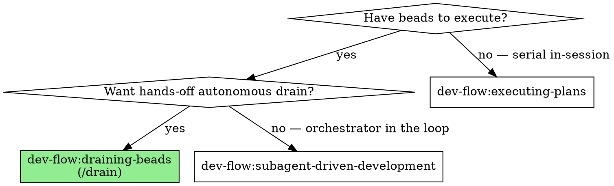

# Draining beads

Autonomous, hands-off bead iteration driven by Claude Code's `/goal` Stop-hook
primitive. One `/drain` invocation creates a per-run drain bead, fires `/goal`,
and then iterates until a clean sentinel or a structural halt — without operator
input between tasks.

The canonical contract lives in
`docs/superpowers/specs/2026-05-22-drain-skill-design.md`. This skill is the
discoverable reference; cite the spec for any contract change.

## Overview

The harness is two pieces:

| Piece | Role |
|---|---|
| `/drain` slash command | Operator entry point: pre-flight, create drain bead (`bd create --type drain`), fire `/goal` |
| `draining-beads` skill | This file — sentinel design, halt conditions, lessons, edge cases |

The drain bead is created with `bd create --type drain` (not `bd mol pour`).
ADR `fhsk-rqh` (superseded) records why the formula/pour approach was abandoned:
bd's cook step downgrades custom step types to `task` and does not substitute
template vars in labels, so a poured drain bead cannot carry type `drain`.

`/goal` (not `/loop`) is the iteration primitive. `/goal` is Claude Code's
native Stop-hook mechanism (verified in binary `2.1.148`): it re-fires a
curated prompt body on every Stop hook until the model sets `goal_status.met`.
Per ADR `fhsk-thw`, `/loop`'s real purpose is timer-based external-state
polling — it has no legitimate niche for bead iteration.

Each iteration runs the 12-step protocol in this skill's *Iteration protocol
(worker)* section. Step 3 of that protocol reads lessons from `bd` notes. Lessons replace the "self-evolving
prompt" anti-pattern: they route through `bd` instead of mutating the prompt
body each round.

## When to use

**vs. `subagent-driven-development` (SDD):** The draining-beads harness calls
SDD's per-iteration 12-step body on every Stop-hook cycle. SDD is the inner
mechanism; `draining-beads` is the autonomy wrapper. Use `/drain` when you want
hands-off epic drain via `/goal`. Use SDD directly when you want an
orchestrator-in-the-loop between tasks.

**vs. `executing-plans`:** Single-session serial execution, no fresh subagents.
Use `executing-plans` as the lightweight alternative when autonomy is not
required or when the session must stay in-context.

## Using `/goal` correctly

`/goal` is a **user-only** Claude Code built-in: there is no `SlashCommand` tool
for it, so an agent **cannot self-invoke it** mid-turn. It executes only from a
submitted turn — interactively by a human, or programmatically via the Agent SDK
(`query({prompt: "/goal …"})`), Remote Control, or a cmux/tmux driver. Therefore:

- **The skill and `/drain` never fire `/goal`.** `/drain` (setup) and
  `/drain worker <id>` only *emit* the Worker condition; a user or driver submits it.
- **Controller / worker split.** The session that sets up the drain (creates and
  stamps the drain bead) and the session that runs `/goal` may be different cold
  Claude sessions in the same jj workspace. The worker inherits no controller context.
- **The `/goal` condition is a self-contained cold-boot pointer** (see the command's
  "Worker condition" section): it names the drain bead, tells the worker to invoke
  this skill for the protocol, and inlines the sentinel predicate. The `/goal`
  evaluator judges the predicate from the transcript, so the predicate must be in
  the condition and the worker must report its sentinel-check result each turn.
- **Cold-boot sequence:** invoke this skill → `bd show <drain-id> --json` (mode,
  scope, workspace, lessons, rejections) → `cd` to `drain_workspace` → run exactly
  one ready bead per the protocol → report the sentinel → stop. The Stop hook
  re-fires the condition for the next bead.
- **Post-`/compact` recovery is automatic:** the active goal survives `/compact`,
  and the re-fired condition always re-points at the skill + bead, so a compacted
  worker re-bootstraps from durable state.
- **Keep the condition small.** `/goal`'s condition is capped (~4,000 chars); the
  pointer form stays well under it. Never inline the 12-step protocol into the condition.

## Iteration protocol (worker)

You are the drain worker. On cold boot you have invoked this skill and read your
assignment from `bd show <drain-id> --json` (mode, scope, `drain_workspace`,
lessons, rejections) and `cd`'d to `drain_workspace`. Each `/goal` Stop-hook
re-fire runs **ONE** bead via the 12 steps below. `<drain-id>` / `<epic-id>` /
`<scope>` / `<sentinel>` come from the drain bead.

1. **Check sentinel** — run the mode-specific bd query (see "Sentinel design"). If
   met: emit a completion summary, append
   `bd note <drain-id> "result: complete; iterations=<N>, ..."`, run
   `bd close <drain-id> --reason="drain completed cleanly"`, invoke
   `dev-flow:finishing-a-development-branch`, then exit (do NOT continue to step 2).
2. **Check halt conditions** — scan `bd show <drain-id> --json | jq -r '.[0].notes'`
   for any "rejection: <id> N=3+" line OR any prior "halt:" line. On match: append
   `bd note <drain-id> "halt: <reason>"`, run `/goal clear`, send PushNotification, exit.
3. **Read lessons** — collect `bd show <drain-id> --json | jq -r '.[0].notes'`
   filtered to prefix "lesson:" (run-scoped). For epic mode, ALSO read the epic's
   notes filtered to "lesson:" (epic-scoped). Concatenate into a lessons variable
   for step 7.
4. **Pick next ready bead** — `bd ready` filtered to in-scope per mode:
   - epic mode: `bd ready --parent "<epic-id>" --json` (descendants of the epic
     currently ready). Use the native `--parent` flag, NOT a jq filter on
     `.parent`: `bd ready` JSON has no `.parent` field (it is always null), so
     `select(.parent == ...)` matches nothing and the queue looks permanently
     empty. The flag matches the sentinel's `bd list --parent` idiom.
   - set mode: filter `bd ready --json` to the explicit seed ids in `<scope>`.
   - cascade mode: maintain a session working set (initially the seeds); after each
     close in step 9, expand via
     `bd dep list <closed-id> --direction=up --json | jq -r '.[].id'`.

   Deterministic order across modes: lowest priority number, then alphabetic id. If
   the filter is empty but the sentinel is unmet → re-evaluate; if still unmet, halt
   with "stalled queue".
5. **Atomic claim** — `bd update <id> --claim`. On race (claim fails), skip step 6
   and restart the iteration.
6. **Load context** — `bd show <id> --json` for description / acceptance / spec-id;
   if a spec-id is present, read the referenced spec/plan file.
7. **Dispatch implementer subagent** — per `dev-flow:subagent-driven-development`:
   subagent_type from the bead's `skills[]` (general-purpose fallback); model from
   the bead's `model:*` label (default sonnet); prompt = description + acceptance +
   spec excerpts + lessons. In jj repos, brief the subagent to run
   `jj --no-pager new` before edits.
8. **Two-stage review** — spec compliance reviewer, then code quality reviewer. On
   either failing, the implementer fixes and re-reviews.
9. **On approval** — `bd close <id> --reason="<one-line summary>"`. Append a bd note
   for any deviations or follow-ups.
10. **On rejection** (review loops exhausted this iteration): `bd update <id>
    --status=open`; `bd note <id> "rejection round N: <reason>"`;
    `bd note <drain-id> "rejection: <id> N=<count>"`. Step 2 catches N>=3 next iteration.
11. **VCS verify** — `jj st` (or `git status --porcelain`); confirm a clean tree. If
    dirty: `bd note <drain-id> "halt: dirty-tree iter <N>"`; halt.
12. **Iteration ends.** The `/goal` Stop hook re-fires the condition → step 1.

## Sentinel design

`/goal`'s `condition` is natural-language evaluated by the model each Stop-hook
iteration. The harness phrases each condition as a checkable predicate the model
can verify with one `bd` query:

| Mode | Sentinel | Verification query |
|---|---|---|
| `epic <id>` | `All beads under epic <id> are closed.` | `bd list --status=open --parent <id> --json \| jq 'length == 0'` |
| `set <ids…>` | `All of {<id1>, …} are closed.` | `for id in $SEEDS; do bd show $id --json \| jq -e '.[0].status == "closed"'; done` |
| `cascade <ids…>` | `All beads in the cascade-reachable set from {seeds} are closed.` | Maintain working set; expand via `bd dep list <id> --direction=up` after each close; query: any open bead in working set? |

See the spec for canonical predicate strings.

## Halt conditions

Three structural events cause the iteration body to explicitly clear `/goal`,
emit a `PushNotification`, and leave the drain bead `--status=in_progress` for
resume:

| # | Trigger | What gets recorded on the drain bead |
|---|---|---|
| 1 | Implementer returns `BLOCKED` status | `bd note <task-id> "BLOCKED iter N: <reason>"`; `bd note <drain-id> "halt: blocked on <task-id>; reason=<short>"` |
| 2 | ≥ 3 rejection rounds on a single task | `bd note <task-id> "rejection round N: <reason>"`; `bd note <drain-id> "rejection: <task-id> N=3"`. Halt-check fires on next iteration's step 2. |
| 3 | VCS / harness failure (dirty working tree across iterations, push fails, `bd dolt` unreachable) | `bd note <drain-id> "halt: vcs-failure; detail=<short>"` |

On any halt: `goal_status.met=false`; drain bead stays `in_progress` (resumable
via `/drain resume <drain-id>`). On clean sentinel: close the drain bead with a
result note.

★ **Insight:** Halt ≠ failure. A halted drain bead is an auditable checkpoint.
The operator triages via `bd show <drain-id>`, resolves the blocker, and resumes.

## Lessons mechanism

Run-level observations are stored as `bd` notes rather than by editing the
prompt body. This eliminates prompt drift and makes lessons queryable. Per ADR
`fhsk-ce3`:

| Scope | Command | Lifetime |
|---|---|---|
| **Run-scoped** | `bd note <drain-id> "lesson: <text>"` | Ephemeral — closes with the drain bead |
| **Epic-scoped** | `bd note <epic-id> "lesson: <text>"` | Persistent — survives across all future runs against this epic |

Step 3 of the iteration body reads both tiers via prefix filter and injects the
collected text into the next implementer subagent's prompt. The orchestrator
elevates a lesson from run-scoped to epic-scoped when it judges the observation
generalizable beyond the current run.

## Edge cases

### Codex compatibility

`/goal` is Claude Code-only. Codex users get a manual loop recipe: drive
iterations interactively, one iteration per fresh prompt cycle, following the
12-step body in `commands/drain.md` by hand. No automation; no sentinel
tracking. The skill's intro states this clearly so Codex users know immediately.

### Context bloat

If iteration count exceeds ~30 OR estimated token usage exceeds 70% of the
model's context limit, run `/compact` between iterations. `/goal` survives
`/compact`: it is a Stop-hook registration, not a prompt-bound construct. The
`activeGoal` state persists across compaction.

### Push timing

Subagents commit but do not push. The orchestrator pushes only at the clean
sentinel, via `dev-flow:finishing-a-development-branch`. On halt, the operator
pushes manually after triage.

### `bd dolt` server crash mid-drain

Falls under halt condition #3 (VCS / harness failure). The drain bead stays
`in_progress`. The operator restarts the dolt server and runs
`/drain resume <drain-id>` to re-fire `/goal` with the original scope. Prior
rejection counts in the drain bead's notes carry forward; circuit-breakers see
them on iteration 1.

### PushNotification unavailable

Fall back to final-turn message text. The drain bead's `bd note` record is the
authoritative audit trail regardless of notification delivery.

## References

| Resource | Path |
|---|---|
| Spec (original design) | `docs/superpowers/specs/2026-05-22-drain-skill-design.md` |
| Spec (cold-boot handoff redesign) | `docs/superpowers/specs/2026-05-24-drain-goal-handoff-redesign-design.md` |
| Slash command | `dev-flow/commands/drain.md` |
| ADR: `/goal` over `/loop` | `fhsk-thw` |
| ADR: harness split (superseded by `fhsk-eqt`) | `fhsk-0o2` |
| ADR: protocol in skill / cold-boot condition / bead carrier | `fhsk-eqt`, `fhsk-zds`, `fhsk-e4i` |
| ADR: `bd mol pour` (superseded) | `fhsk-rqh` |
| ADR: lessons in bd notes | `fhsk-ce3` |
| ADR: `/drain init` explicit | `fhsk-0cd` |
| Rule 1 (structure in specs/plans) | `dev-flow/AGENTS.md` |
| Rule 5 (model selection on beads) | `dev-flow/AGENTS.md` |
| Rule 6 (design-bead lifecycle) | `dev-flow/AGENTS.md` |
| Rule 7 (grounding before design) | `dev-flow/AGENTS.md` |
