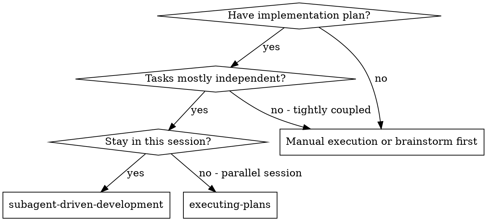
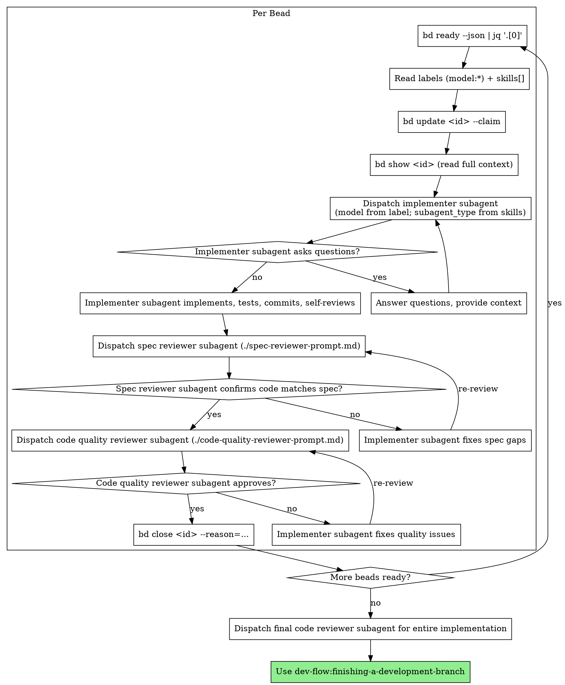

# Subagent-Driven Development

Execute plan by dispatching fresh subagent per task, with two-stage review after each: spec compliance review first, then code quality review.

**Why subagents:** You delegate tasks to specialized agents with isolated context. By precisely crafting their instructions and context, you ensure they stay focused and succeed at their task. They should never inherit your session's context or history — you construct exactly what they need. This also preserves your own context for coordination work.

**Core principle:** Fresh subagent per task + two-stage review (spec then quality) = high quality, fast iteration

**Continuous execution:** Do not pause to check in with your human partner between tasks. Execute all tasks from the plan without stopping. The only reasons to stop are: BLOCKED status you cannot resolve, ambiguity that genuinely prevents progress, or all tasks complete. "Should I continue?" prompts and progress summaries waste their time — they asked you to execute the plan, so execute it.

**Autonomous epic drain:** For a long-running, hands-off drain of an epic or seed set, pair this skill with `dev-flow:draining-beads` (operator entry: `/drain epic <id>` / `/drain set <id...>` / `/drain cascade <id...>`). The drain skill harnesses this one with Claude Code's `/goal` Stop hook so the orchestrator stays running until the sentinel is met or a halt condition fires. Requires Claude Code 2.1.148+ with hooks enabled.

**Prerequisite — docs reachable from `main`:** The spec, plan, and any ADRs that inform this work SHOULD be merged to `main` before dispatching subagents. Subagents work in fresh worktrees / sessions off `main`; if the docs aren't there yet, each dispatch needs the spec text inlined into the subagent prompt (out-of-band briefing), which bloats prompts and risks staleness. `writing-plans` step 4 recommends a docs-only PR for exactly this reason. On dispatch, briefly verify that the bead's `--spec-id` resolves to a file reachable from the worktree's `main`; if not, either (a) inline the spec excerpts the subagent needs, or (b) land the docs first and re-dispatch.

## When to Use



**vs. Executing Plans (parallel session):**

- Same session (no context switch)
- Fresh subagent per task (no context pollution)
- Two-stage review after each task: spec compliance first, then code quality
- Faster iteration (no human-in-loop between tasks)

## The Process

### Picking the next task (bd-driven)

This skill reads tasks from `bd`, not from a markdown plan. The plan has already been materialized into beads by `writing-plans` (auto-firing `plan-to-beads`), so the source of truth for "what work remains" is `bd ready`.

1. **Query `bd ready --json | jq '.[0]'`** to get the next unblocked bead. Skip claimed (`in_progress`) and blocked beads — `bd ready` does this filtering already. If the queue is empty, jump to "all tasks complete" (dispatch final reviewer, then `finishing-a-development-branch`).
2. **Read the bead's routing hints** from the JSON:
   - `labels[]` — look for `model:haiku`, `model:sonnet`, or `model:opus`. **Default to `sonnet` if no `model:*` label is present.** No fallback to "highest available"; explicit default keeps cost predictable (per Rule 5).
   - `skills[]` — the bd `--skills` field is a routing hint for which subagent type to dispatch (e.g. `review`, `test`, `debug`, `infra`).
3. **Atomically claim the bead:** `bd update <id> --claim`. Atomic claim prevents double-dispatch when multiple controllers race. If the claim fails (bead was claimed by another actor since `bd ready`), loop back to step 1.
4. **Load the bead's full context:** `bd show <id>`. Read description, acceptance criteria, notes, `--spec-id`, dependency edges. The bead's `--spec-id` points to the originating spec/plan path; read those for surrounding context if the description references them.
5. **Dispatch a fresh subagent:**
   - **`subagent_type`** — map the bead's `skills[]` to an available agent type. Heuristic: `general-purpose` if no match; specific types (e.g. `test-author`) if available and matching. Do NOT map `skills[]` containing `review` to the `code-reviewer` agent — that agent is the `review-pr` orchestrator's bd-finding agent and requires the orchestrator contract (`PARENT_BEAD_ID`, `PR_URL`, `ASPECT`). In-session review is handled by the two-stage review below (spec then quality) using the `requesting-code-review` template via `general-purpose`. Implementer judgment governs the mapping when multiple skills overlap.
   - **`model`** — set from the bead's `model:*` label (default `sonnet` when absent).
   - **prompt** — assembled from bead description + acceptance criteria + relevant spec/plan excerpts read in step 4. Do NOT make the subagent read the bead itself — provide the text directly per the "Make subagent read plan file" red flag.
6. **Two-stage review after the subagent returns** (existing process: spec compliance first, then code quality).
7. **On approval:** `bd close <id> --reason="<summary of what landed>"`. The bead's audit trail (claim time, review rounds, close reason) is preserved.
8. **On rejection (subagent unable to complete after review loops):** `bd update <id> --status=open` to release the claim, file a `bd note <id> "Dispatch round N rejected: <reason>"`, and dispatch again with revised instructions (or escalate to the human per the BLOCKED protocol).
9. **Loop to step 1** until `bd ready` returns empty.



**Degraded mode:** If `bd` is unavailable, fall back to reading the plan file directly: extract `### Task N:` headers, build a local TodoWrite list, dispatch as before but without atomic claim, label-driven model selection, or close-on-completion accounting.

## Model Selection (label-driven, Rule 5)

The bead's `model:*` label is the source of truth for dispatch model. `plan-to-beads` proposes labels heuristically based on task content; the user reviews / overrides during the dry-run preview; the labels travel with the bead.

| Label | When | Examples |
|---|---|---|
| `model:haiku` | Mechanical, high-volume, low-judgment | Regex rename across N files, scaffold from template, generate test boilerplate, JSON manifest edits |
| `model:sonnet` (default) | Most implementation | New feature, bug fix, refactor with judgment, normal subagent task |
| `model:opus` | Hard reasoning, architecture, cross-cutting risk | Plan-reviewer dispatch, security-sensitive code, multi-file refactors with subtle invariants, debugging distributed-state bugs |

**Enforcement:**

- Read the bead's `labels[]` array from `bd show <id> --json`.
- Find the first entry matching `^model:(haiku|sonnet|opus)$`.
- If found: pass that value as the Agent tool's `model` parameter.
- If absent: pass `sonnet`. **Do NOT fall back to "highest available"** — explicit default keeps cost predictable.

Code-quality reviewer subagents inherit the same label discipline. The final whole-implementation reviewer typically warrants `opus` regardless of any individual bead's label.

## Handling Implementer Status

Implementer subagents report one of four statuses. Handle each appropriately:

**DONE:** Proceed to spec compliance review.

**DONE_WITH_CONCERNS:** The implementer completed the work but flagged doubts. Read the concerns before proceeding. If the concerns are about correctness or scope, address them before review. If they're observations (e.g., "this file is getting large"), note them and proceed to review.

**NEEDS_CONTEXT:** The implementer needs information that wasn't provided. Provide the missing context and re-dispatch.

**BLOCKED:** The implementer cannot complete the task. Assess the blocker:

1. If it's a context problem, provide more context and re-dispatch with the same model
2. If the task requires more reasoning, re-dispatch with a more capable model
3. If the task is too large, break it into smaller pieces
4. If the plan itself is wrong, escalate to the human

**Never** ignore an escalation or force the same model to retry without changes. If the implementer said it's stuck, something needs to change.

## Prompt Templates

- `./implementer-prompt.md` - Dispatch implementer subagent
- `./spec-reviewer-prompt.md` - Dispatch spec compliance reviewer subagent
- `./code-quality-reviewer-prompt.md` - Dispatch code quality reviewer subagent

## Example Workflow

```text
You: I'm using Subagent-Driven Development to execute this plan.

[bd ready --json | jq '.[0]']
Bead: bd-42 — "Implement hook installation script" (labels: model:sonnet, skills: infra,test)

[bd update bd-42 --claim]
[bd show bd-42 — read description + acceptance + spec-id (docs/superpowers/specs/...)]

Task: bd-42 — Hook installation script

[Dispatch implementation subagent: subagent_type=general-purpose, model=sonnet,
 prompt=bead description + acceptance + relevant spec excerpts]

Implementer: "Before I begin - should the hook be installed at user or system level?"

You: "User level (~/.config/superpowers/hooks/)"

Implementer: "Got it. Implementing now..."
[Later] Implementer:
  - Implemented install-hook command
  - Added tests, 5/5 passing
  - Self-review: Found I missed --force flag, added it
  - Committed

[Dispatch spec compliance reviewer]
Spec reviewer: ✅ Spec compliant - all requirements met, nothing extra

[Get git SHAs, dispatch code quality reviewer (model=sonnet from bead label)]
Code reviewer: Strengths: Good test coverage, clean. Issues: None. Approved.

[bd close bd-42 --reason="Hook installation script + tests landed; all reviews passed"]

[bd ready --json | jq '.[0]']
Bead: bd-43 — "Recovery modes" (labels: model:opus, skills: infra,debug)

[bd update bd-43 --claim]
[bd show bd-43]

Task: bd-43 — Recovery modes

[Dispatch implementation subagent: subagent_type=general-purpose, model=opus
 (cross-cutting risk per label), prompt=bead description + acceptance]

Implementer: [No questions, proceeds]
Implementer:
  - Added verify/repair modes
  - 8/8 tests passing
  - Self-review: All good
  - Committed

[Dispatch spec compliance reviewer]
Spec reviewer: ❌ Issues:
  - Missing: Progress reporting (spec says "report every 100 items")
  - Extra: Added --json flag (not requested)

[Implementer fixes issues]
Implementer: Removed --json flag, added progress reporting

[Spec reviewer reviews again]
Spec reviewer: ✅ Spec compliant now

[Dispatch code quality reviewer]
Code reviewer: Strengths: Solid. Issues (Important): Magic number (100)

[Implementer fixes]
Implementer: Extracted PROGRESS_INTERVAL constant

[Code reviewer reviews again]
Code reviewer: ✅ Approved

[bd close bd-43 --reason="Recovery modes shipped; progress reporting per spec"]

...

[bd ready returns empty — all beads in epic closed]
[Dispatch final code-quality review (opus) for the entire implementation, using the requesting-code-review template via general-purpose]
Final reviewer: All requirements met, ready to merge

[Hand off to dev-flow:finishing-a-development-branch — its Step 0 pre-flight
 will confirm zero open beads in the epic; Step 5.5 will close the epic itself
 after merge succeeds]

Done!
```

## Advantages

**vs. Manual execution:**

- Subagents follow TDD naturally
- Fresh context per task (no confusion)
- Parallel-safe (subagents don't interfere)
- Subagent can ask questions (before AND during work)

**vs. Executing Plans:**

- Same session (no handoff)
- Continuous progress (no waiting)
- Review checkpoints automatic

**Efficiency gains:**

- No file reading overhead (controller provides full text)
- Controller curates exactly what context is needed
- Subagent gets complete information upfront
- Questions surfaced before work begins (not after)

**Quality gates:**

- Self-review catches issues before handoff
- Two-stage review: spec compliance, then code quality
- Review loops ensure fixes actually work
- Spec compliance prevents over/under-building
- Code quality ensures implementation is well-built

**Cost:**

- More subagent invocations (implementer + 2 reviewers per task)
- Controller does more prep work (extracting all tasks upfront)
- Review loops add iterations
- But catches issues early (cheaper than debugging later)

## Red Flags

**Never:**

- Start implementation on main/master branch without explicit user consent
- Skip reviews (spec compliance OR code quality)
- Proceed with unfixed issues
- Dispatch multiple implementation subagents in parallel (conflicts)
- Make subagent read plan file (provide full text instead)
- Skip scene-setting context (subagent needs to understand where task fits)
- Ignore subagent questions (answer before letting them proceed)
- Accept "close enough" on spec compliance (spec reviewer found issues = not done)
- Skip review loops (reviewer found issues = implementer fixes = review again)
- Let implementer self-review replace actual review (both are needed)
- **Start code quality review before spec compliance is ✅** (wrong order)
- Move to next task while either review has open issues

**If subagent asks questions:**

- Answer clearly and completely
- Provide additional context if needed
- Don't rush them into implementation

**If reviewer finds issues:**

- Implementer (same subagent) fixes them
- Reviewer reviews again
- Repeat until approved
- Don't skip the re-review

**If subagent fails task:**

- Dispatch fix subagent with specific instructions
- Don't try to fix manually (context pollution)

## Integration

**Required workflow skills:**

- **superpowers:using-worktrees** - Ensures isolated workspace (creates one or verifies existing)
- **superpowers:writing-plans** - Creates the plan this skill executes
- **superpowers:requesting-code-review** - Code review template for reviewer subagents
- **superpowers:finishing-a-development-branch** - Complete development after all tasks

**Subagents should use:**

- **superpowers:test-driven-development** - Subagents follow TDD for each task

**Alternative workflow:**

- **superpowers:executing-plans** - Use for parallel session instead of same-session execution
