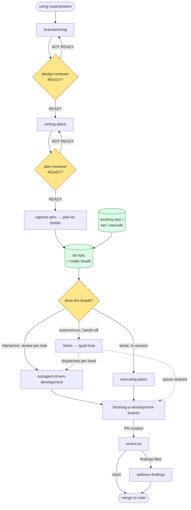

# dev-flow Pipeline

`dev-flow` is one linear pipeline with two adversarial review gates, a single
bead-graph junction, and a tail that carries work from PR to merge. Skills are
the steps; agents are dispatched *by* skills (never entry points). This document
is the map; each skill's `SKILL.md` is authoritative for its own contract.

## The flow

## How to read it

**The spine** runs `using-superpowers` → `brainstorming` → `writing-plans` →
`capture-adrs` → `plan-to-beads` → execution → `finishing-a-development-branch`
→ `review-pr` → `address-findings` → merge.

**Two adversarial gates** share one `READY` / `NOT READY` contract and loop back
on failure:

- `design-reviewer` gates the spec after `brainstorming`.
- `plan-reviewer` gates the plan after `writing-plans`.

Both are read-only agents the skill dispatches and whose verdict line it parses;
they are drawn as the gate diamonds, not as separate nodes.

**The auto-fire chain.** On a `READY` plan, `writing-plans` fires
`capture-adrs` (which may dispatch the `adr-extractor` agent and file decision
beads) and then `plan-to-beads`, in that order, as one unit.

## The branch point: the bead epic

`plan-to-beads` materializes the plan into a **`bd` epic with ready child
beads**. That epic is the pipeline's one real junction. Three drivers consume
the same bead graph:

| Driver | Mode | Operator involvement |
|--------|------|----------------------|
| `subagent-driven-development` | interactive | reviews between each task (two-stage: spec then quality) |
| `executing-plans` | serial, in-session | runs the beads in the current session |
| `/drain` (`epic` / `set` / `cascade`) | autonomous | none — `/goal` re-fires until the queue drains |

`/drain` is **not a fourth path**: its command contract states it "drives
`subagent-driven-development` across a queue of beads via Claude Code's built-in
`/goal` Stop hook." It is the autonomous wrapper that dispatches SDD per bead,
which is why the diagram shows `drain -. dispatches per bead .-> sdd`. The
`draining-beads` skill holds its sentinel design, halt conditions, and the
per-iteration protocol; `docs/superpowers/specs/2026-05-22-drain-skill-design.md`
is the canonical contract.

The epic has a **second entry**: `/drain epic|set|cascade <id>` can be invoked
on any pre-existing ready bead graph, without having just run `writing-plans` —
shown by the `existing epic / set / cascade` node feeding the junction.

## The review-and-integrate tail

`finishing-a-development-branch` ends in a PR (Option 2) and now suggests
`/review-pr <n>`. `review-pr` dispatches up to ten review agents (`code-reviewer`,
`security-auditor`, `slop-hunter`, plus type / test / comment / api / spec /
errors / simplify), files findings as beads, and — when findings exist —
suggests `/address-findings <n>`. `address-findings` runs the fix loop
(`fix-worker` → `review-gate` → `verification-runner`) until findings are
resolved, then the work merges.

## What this view abstracts

This is the happy-path skill spine. Three things live a level below it:

- **In-session review** (`requesting-code-review` template + `receiving-code-review`
  mindset) is the two-stage spec→quality review that runs *inside*
  `subagent-driven-development` per task — distinct from the PR-level `review-pr`
  path. Review happens at two altitudes.
- **`/drain`'s internal protocol** (per-iteration 12 steps, sentinels, lessons
  via `bd` notes) is below the single `drain` node here.
- **Cross-cutting discipline** — `test-driven-development`, `systematic-debugging`,
  `verification-before-completion` — applies throughout execution rather than at
  one node.

Support skills not on the spine: `using-worktrees` / `using-git-worktrees`
(isolation), `dispatching-parallel-agents`, `bead-create-smart`, `handoff-prompt`,
`evolve-adr`, and `writing-skills`.
