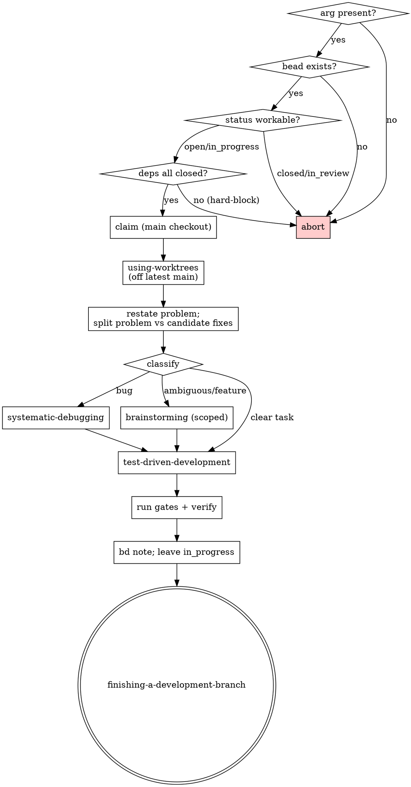

<!-- markdownlint-disable MD013 -->

# Design: `solving-a-bead` skill + `/solving-a-bead` command

**Design bead:** `fhsk-eip`
**Date:** 2026-05-29
**Status:** Draft (pending design-reviewer)

## Problem

The `dev-flow` plugin can brief a *fresh* session on a bead (`handoff-prompt`)
and can drain beads *autonomously* (`draining-beads` / `/drain`), but it has no
**interactive, in-session** entry point for "pick up this one bead and solve it
now, here, with me." Operators who want to work a single bead by hand currently
improvise the sequence (validate → isolate → triage → fix), which means the
discipline guarantees — root-cause-before-fix, test-before-code — are applied
inconsistently.

A second, sharper problem: bead descriptions (especially `bug` beads) frequently
contain a suggested fix ("fix it by doing X", "the solution is Y"). Treating
that text as an instruction short-circuits diagnosis and produces symptom
patches. The workflow MUST treat any such suggestion as a **non-authoritative
hypothesis**, never as a directive.

## Goal

A thin orchestrator skill, `solving-a-bead`, plus a 1:1 slash command
`/solving-a-bead <bead-id>`, that drives a single bead from validation through a
root-caused, test-driven solution to a clean hand-off, delegating discipline to
existing rigid skills rather than reimplementing it.

## Non-goals

- Not autonomous iteration over multiple beads (that is `draining-beads`).
- Not a fresh-session briefing generator (that is `handoff-prompt`).
- Does **not** open a PR or close the bead. Integration is handed off to
  `finishing-a-development-branch`; closure happens at merge time.

## Composition

`solving-a-bead` is an orchestrator. It owns sequencing and the
problem-vs-suggested-fix separation; everything else is delegated:

| Concern | Delegated to |
|---|---|
| Isolated workspace off latest main (git/jj) | `dev-flow:using-worktrees` |
| Root-cause-before-fix discipline (bug beads) | `dev-flow:systematic-debugging` |
| Firming up ambiguous / feature requirements | `dev-flow:brainstorming` |
| Test-before-code discipline | `dev-flow:test-driven-development` |
| Evidence-before-claims at completion | `dev-flow:verification-before-completion` |
| Merge / PR integration options | `dev-flow:finishing-a-development-branch` |

## Deliverables

| File | Purpose |
|---|---|
| `dev-flow/skills/solving-a-bead/SKILL.md` | Canonical reference; the phased workflow |
| `dev-flow/commands/solving-a-bead.md` | Thin operator entry; parses `<bead-id>` arg |

**No release registration needed.** As of PR #115 (ADR `fhsk-7y4`), the repo
uses a single repo-wide cocogitto version derived from conventional commits —
the 15 per-package release-please streams (and their `*-config.json` /
`*-manifest.json` files) were removed. Adding a skill no longer touches any
release manifest; skills auto-discover (`dev-flow/plugin.json` does not
enumerate them) and `.claude-plugin/marketplace.json` lists plugins, not
skills. The skill is purely the SKILL.md + command file.

## SKILL.md frontmatter

```yaml
---
name: solving-a-bead
description: Use when asked to solve, fix, address, or work a specific bead/issue
  by ID — validates the bead is open and unblocked, creates an isolated workspace
  off latest main, separates the problem from any suggested fix (treating suggested
  fixes as non-authoritative hypotheses), then drives a root-caused, TDD solution.
metadata:
  author: fzymgc-house
---
```

(No `version:` field — under the cog tag-only flow, SKILL.md frontmatter
carries only `metadata.author`, matching the current `using-worktrees` /
`finishing-a-development-branch` skills on `main`.)

The body opens with the standard VCS preamble line:

> **Before running any VCS commands, read `references/vcs-preamble.md` and use
> the appropriate commands for the detected VCS (git or jj).**

## Command frontmatter

```yaml
---
description: Solve a single bead interactively — validate, isolate, triage, TDD fix, hand off.
argument-hint: "<bead-id>"
allowed-tools: ["Read", "Grep", "Glob", "AskUserQuestion", "Skill(dev-flow:*)", "Bash(bd show:*)", "Bash(bd update:*)", "Bash(bd note:*)", "Bash(bd dep list:*)", "Bash(jj root:*)", "Bash(jj st:*)", "Bash(git status:*)", "Bash(git rev-parse:*)", "Bash(jq:*)"]
---
```

The command body parses `$ARGUMENTS` as a single `<bead-id>`; missing/empty →
print usage and exit. Otherwise it invokes the `solving-a-bead` skill with that
ID. The skill is the canonical reference (mirrors the `/drain` ↔ `draining-beads`
relationship).

## Phased workflow

### Phase 0 — Validate (hard gates; abort on any failure)

These gates run from the **main checkout** (before any workspace exists):

1. **Arg present.** No `<bead-id>` → print usage, exit.
2. **Bead exists.** `bd show <id> --json` returns a record. Else abort.
3. **Status is workable.** Read `.[0].status`:
   - `open` → proceed.
   - `in_progress` → note "already claimed — resuming" and proceed.
   - `closed` / `in_review` (or any other) → abort, reporting the actual status.
     (`in_review` is a real bd status — a bead whose work is done and awaiting
     review; the skill refuses it because the implementation phase is over.)
4. **No unmet dependencies.** `bd dep list <id>` — if any blocker dependency is
   not `closed`, **HARD-BLOCK + abort**, listing the offending blocker IDs so
   the user knows what to finish first.

### Phase 1 — Claim & isolate

5. **Capture context** from the `bd show --json` already read: title, type,
   description, acceptance, notes, and labels (`model:*`, `agent:*`).
6. **Claim** from the main checkout: `bd update <id> --claim` (atomic; sets
   `in_progress` + assignee). Claiming from the main checkout — not inside the
   new workspace — avoids the macOS sandbox SQLite-write-in-worktree issue.
7. **Isolate.** Invoke `dev-flow:using-worktrees` to create an isolated
   workspace off **latest main** (it fetches first and handles git worktree /
   jj workspace via VCS detection) and move into it. Sequence preserved:
   validate → workspace → triage.

### Phase 2 — Triage (the core mechanism)

8. **Restate the problem in your own words**, then split the bead body into two
   explicitly labeled buckets:

   - **Problem / symptom / desired outcome** — authoritative.
   - **Candidate solutions (NON-AUTHORITATIVE — to be validated, never followed
     blindly)** — every "fix it by…", "do X", "the solution is…" sentence from
     the bead lands here, demoted to hypothesis status.

9. **Route by classification:**

   | Bead shape | Route |
   |---|---|
   | `bug` / defect / error / unexpected behavior | `dev-flow:systematic-debugging` — its Iron Law (*NO FIXES WITHOUT ROOT CAUSE FIRST*) is the guarantee; each candidate solution enters as a hypothesis, adopted only if the confirmed root cause demands it |
   | Ambiguous / feature / unclear approach | `dev-flow:brainstorming`, scoped to the bead |
   | Clear, well-specified `task` / `chore` | Straight to Phase 3 |

10. **Red-flags table** (in the SKILL body) codifies the discipline:

    | Thought | Reality |
    |---|---|
    | "The bead says to fix it by doing X" | X is a hypothesis. Confirm the root cause requires X before implementing. |
    | "The reporter already diagnosed it" | Reporter diagnosis is a lead, not a conclusion. Reproduce and verify. |
    | "This is obviously the fix" | Obvious fixes mask root causes. systematic-debugging Phase 1 first. |

### Phase 3 — TDD implementation

11. Invoke `dev-flow:test-driven-development`: write a failing test encoding the
    bead's acceptance criteria (or the reproduced bug) → watch it fail → minimal
    code to pass → refactor. "As much as possible" is honored via TDD's own
    documented exceptions (config / docs / throwaway — ask the human partner
    before skipping).
12. Run the bead's verification commands (from its `--notes`) plus the project
    quality gates relevant to the changed surface.

### Phase 4 — Verify & hand off

13. Apply `dev-flow:verification-before-completion` — show actual command output
    before any "done" claim.
14. `bd note <id>` summarizing root cause (for bugs) or approach (for features)
    and the fix. **Leave the bead `in_progress`** — closure happens at merge,
    not here.
15. Suggest `dev-flow:finishing-a-development-branch`, which presents
    merge / PR / cleanup options. Does **not** auto-open a PR.

## Process flow



## Testing strategy

The deliverable is documentation (a SKILL.md + a command.md), not executable
code, so the verification surface is:

- `rumdl check` on both new markdown files (140-char width per `.rumdl.toml`).
- Manual smoke: the skill's frontmatter `name` matches the directory, and the
  command's `argument-hint` / `allowed-tools` are well-formed.

A behavioral eval (in the `dev-flow/evals` style) MAY be added later but is out
of scope for the initial skill.

## Open questions

None outstanding. The two contested decisions were resolved with the user:

- Phase 0 status rule: require `open`; allow `in_progress` as resume; abort on
  `closed`/`in_review`.
- Hand-off leaves the bead `in_progress` rather than closing it.
<!-- adr-capture: sha256=60f2942c5d741802; session=cli; ts=2026-05-29T14:50:17Z; adrs=fhsk-ypt,fhsk-3xn,fhsk-hj3 -->
